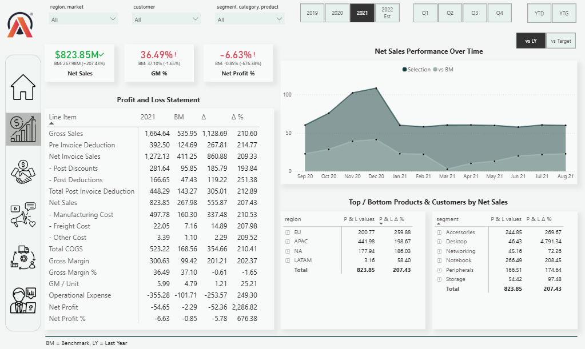
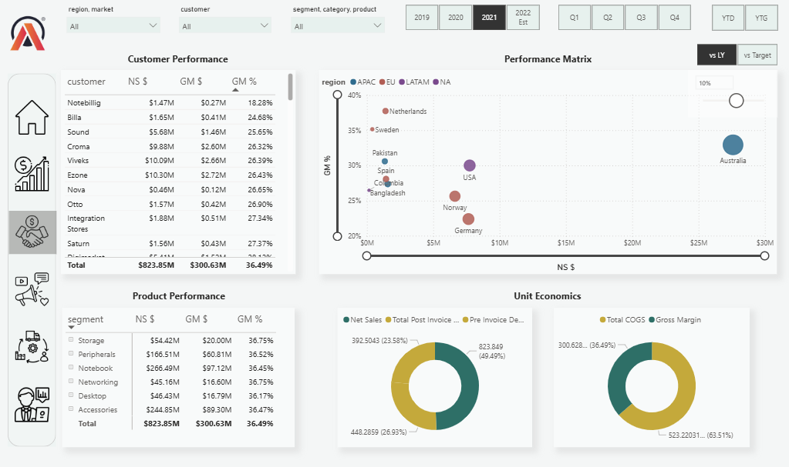
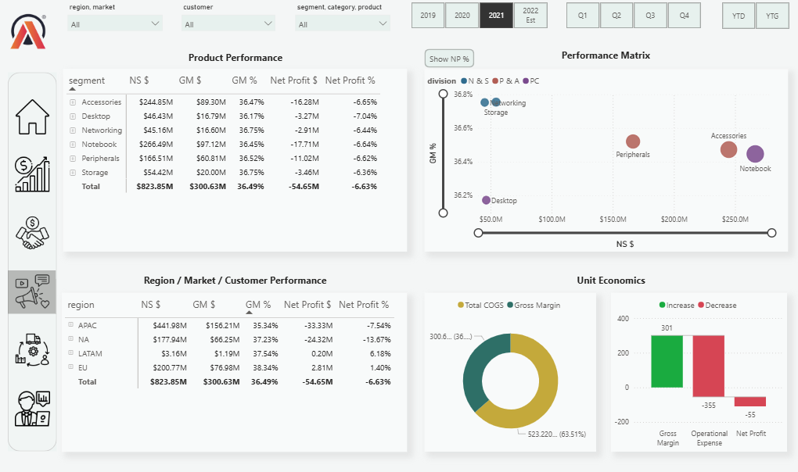
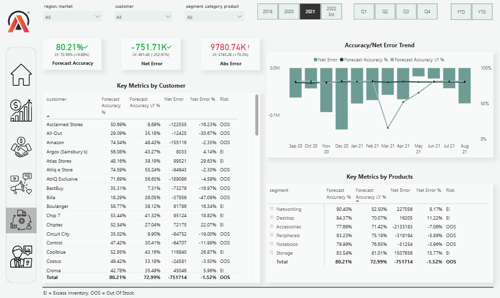
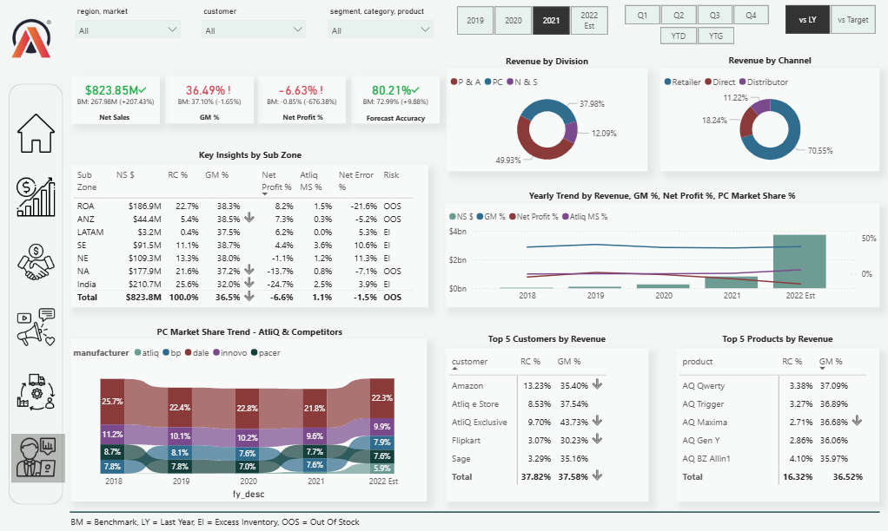

# Business Insights 360

🔗 **Live Dashboard:** 
[PowerBI Link](https://app.powerbi.com/view?r=eyJrIjoiYzVlZDNiYmYtYmVjNi00NDcwLTgwODktODk4NDM2YmFmZDk5IiwidCI6ImM2ZTU0OWIzLTVmNDUtNDAzMi1hYWU5LWQ0MjQ0ZGM1YjJjNCJ9)

## Problem Overview

This project was developed as part of the Power BI course at Codebasics and aims to provide a comprehensive, integrated business intelligence solution for AtliQ, a rapidly growing global company. AtliQ faced significant challenges in managing and analyzing its operational data due to the reliance on Excel spreadsheets for data analytics. The project involved transitioning their data analysis capabilities to Power BI, enabling real-time, actionable insights across multiple business domains to drive data-driven decision-making.

## Problem Statement

AtliQ, a business with operations expanding across multiple countries, was struggling with the increasing complexity of its operations. Despite their rapid growth, the company was relying heavily on Excel for data analysis, which was time-consuming, error-prone, and lacked scalability. This caused inefficiencies in decision-making and led to significant financial losses, particularly in their Latin American market, due to the inability to extract meaningful insights from their data in real time.

## Objectives

The primary objective of this project was to transition AtliQ from its outdated Excel-based analysis process to a more scalable and efficient Power BI solution. The goal was to develop an interactive, dynamic, and integrated Power BI dashboard capable of providing real-time insights, improving operational efficiency, and empowering decision-makers at all levels of the business with actionable data.

## Key Features & Business Functions

**1. Finance View:** Displays Profit & Loss (P&L) statements for specific customers, products, and countries over any given time period. Allows for the detailed analysis of financial performance, including revenue, expenses, and profitability metrics.

  

**2. Sales View:** Offers a detailed performance analysis based on key metrics such as Net Sales, Gross Margin, and Profitability. Provides a Growth Matrix for assessing sales performance and profitability of individual customers, products, and regions.

  

        
**3. Marketing View:** Evaluates the performance of products in the market, focusing on metrics like Net Sales and Gross Margin. Visualizes the profitability and growth potential of products through an interactive matrix, helping prioritize marketing efforts.

 

  

**4. Supply Chain View:** Tracks key metrics such as Forecast Accuracy, Net Error, and Risk Profiles for different segments, categories, and customers. Assists in identifying areas of improvement for supply chain optimization and risk management.

  

 

**5. Executive View:** A high-level, consolidated dashboard that presents key insights across all business areas, providing executives with a comprehensive overview of performance and operational health.

  

 

## Project Implementation

The development of this Power BI solution followed a structured end-to-end BI workflow, covering database design, ETL processes, data modeling, visualization, and automated deployment.

1. Database Design and Setup: Designed a centralized data architecture using a Snowflake schema to ensure data consistency, scalability, and optimized analytical performance. Structured fact and dimension tables with well-defined relationships to support multi-dimensional analysis across finance, sales, marketing, and supply chain functions.

2. Data Extraction and ETL Processes: Extracted data from multiple sources, including MySQL databases and Excel files. Implemented ETL processes using SQL and Power Query to clean, validate, and transform raw datasets into standardized analytical tables. Ensured data quality, consistency, and integrity before loading into the Power BI model.

3. Data Modeling: Built a robust data model integrating 10+ related tables using the Snowflake schema. Established optimized relationships and created calculated columns and advanced DAX measures to support complex KPIs such as Net Sales, Gross Margin, Profitability, Forecast Accuracy, and Growth Analysis. The model was designed to enable accurate cross-functional reporting and performance tracking.

4. Visualization and Reporting: Developed interactive dashboards using Power BI, incorporating KPIs, dynamic slicers, drill-through functionality, bookmarks, and navigation buttons. Designed user-centric reports that allow stakeholders to explore data at multiple granularity levels. Published reports to Power BI Service to enable secure sharing across departments.

5. Automation & Data Refresh: Configured Power BI Gateway to enable automated scheduled data refresh, eliminating manual reporting dependencies. Ensured real-time data availability for executives and operational teams, supporting timely and data-driven decision-making.

## Technology Stack

- **Power BI**: Designed interactive dashboards, KPI reports, and drill-down analytics.

- **MySQL**: Managed and structured relational business data for scalable reporting and analysis.

- **ETL Processes**: Extracted, cleaned, transformed, and standardized data from multiple sources to ensure data consistency and reliability.

- **DAX (Data Analysis Expressions)**: Developed advanced measures, calculated columns, and business logic for profitability, growth, and performance analysis.

- **Power BI Service**: Published reports, enabled cloud-based sharing, and implemented automated scheduled data refresh.

- **Snowflake Schema**: Designed an optimized dimensional data model with fact and dimension tables to improve analytical performance and scalability.

## Conclusion

This project reflects my ability to bridge business strategy and data analytics by delivering scalable, insight-driven BI solutions using modern tools and structured data architecture.
